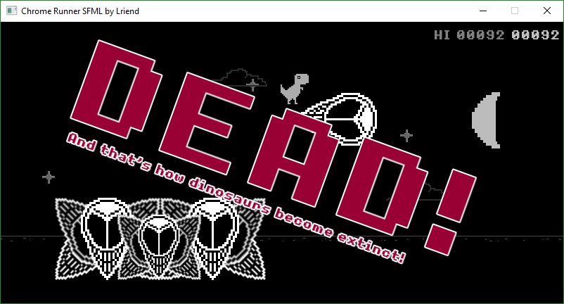
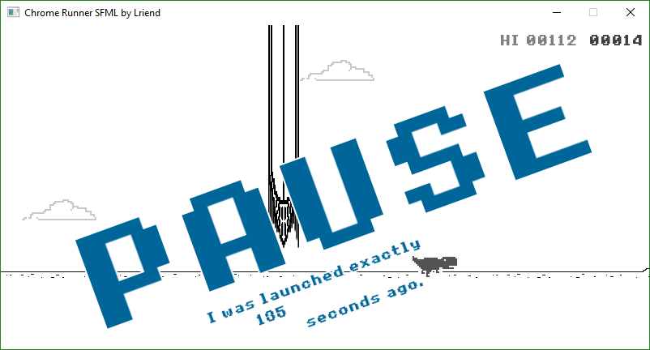

# ChromeRunnerSFML
Chrome Dinosaur game variation made in C++/SFML

THIS IS EXE BRANCH - TO PEEK AT THE CODE GO TO "master" BRANCH

Just like (g)old Offline Chrome Runner Mini-Game, but you can move forward and backward. Also jump is quite different, cause the longer you press the jump button the higher you get. Press 'P' or 'Escape' to pause the game. Exit on 'Q'. Use arrows to move.

Screenshot:

